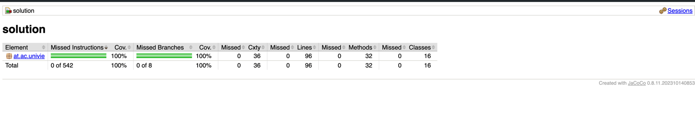
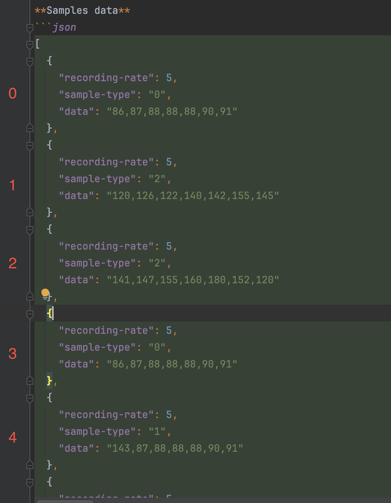

# About solution

You need jdk 17 and maven to build this project.

https://adoptium.net/en-GB/
https://maven.apache.org/

to compile code:
```shell
mvn clean compile test-compile
```
to build and install artifact locally:
```shell
mvn clean install
```
to run tests with coverage
```shell
mvn clean test jacoco:report
```
report is visible here:

target/site/jacoco/index.html
target/site/jacoco/index.csv

last coverage is 100% and that is the proof:



Since I needed to make some decisions during development this solution I have decided to list them here as ADRs.

## ADR

### ADR 1
Date: 2024-09-18

Problem: choice of programming language to solve task

Drivers: author knows java best, javascript/typescript are preferred

Decision: use java

Benefits: save time and show author's skills

Drawbacks: use not preferred language, probably loose some recruitment points

Alternatives: kotlin, javascript, typescript

### ADR 2

Date: 2024-09-18

Problem: about library dependencies

Drivers: it is a library and will be used by other projects with different library sets

Decision: Since it is library I have decided to have the least possible amount of dependencies.

Benefits: lightweight, not causing dependencies issues to projects that will use it

Drawbacks: can't use helpful libraries

Alternatives: probably no alternative here.

### ADR 3

Date: 2024-09-18

Problem: coding style

Drivers: task needed to be solved in a good style with code coverage

Decision: use tdd, tests first, then minimum implementation code that makes tests green

Benefits: code coverage, fun :)

Drawback: a lot of independent tests that test 1 single value, instead of less tests that test more values at once

Alternatives: code first, test after

### ADR 4

Date: 2024-09-18

Problem: solution needs to parse json

Drivers: library has to be easy to use, widely used and still developed/maintained, to avoid risk of future replacement.

Decision: faster-xml jackson

Benefits: well known library

Drawbacks: -

Alternatives: gson

### ADR 5

Date: 2024-09-18

Problem: solution needs library for logging

Drivers: library has to be easy to use, widely used and still developed/maintained, to avoid risk of future replacement.

Decision: slf4j (facade for java) + logback as a provider

Benefits: well known library

Drawbacks: -

Alternatives: a lot of alternatives in java

### ADR 6

Date: 2024-09-18

Problem: should library keep values in memory after being loaded?

Drivers: library should be easy to use, but I have concerns about creating stateful stuff.

Decision: library should not be stateful, "load" methods should return values that can be passed to "process" method

Benefits: not stateful

Drawbacks: client of this library has to know about return type from each of "load" method then pass them to "process" method so it is a little bit harder to use that stateful equivalent

Alternatives: stateful but no return values from "load" methods

### ADR 7

Date: 2024-09-19

Problem: I don't know what does "sample index" mean

Drivers: I need that information to properly solve task, however since I am using TDD and a lot of small independent tests - there is only one test that is responsible for this, so it is easy to change implementation and tests if my assumption was wrong

Decision: assume meaning of "sample index" as it is presented below:



Benefits: I can go further with implementation of the task solution, my assumption can be wrong

Drawbacks: my assumption can be wrong

Alternative: assume other way :)
